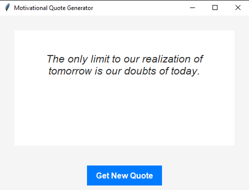

---

# 🎉 Motivational Quote Generator 🌟

Welcome to the **Motivational Quote Generator**! This simple and charming application serves up random motivational quotes to give you a boost of inspiration whenever you need it. Built with Python's `tkinter` and `PIL` libraries, this app features a sleek and modern interface with a custom-curved button.

## 🚀 Features

- 🌈 **Random Quotes**: Get a new motivational quote with the click of a button.
- 🎨 **Custom Design**: A visually appealing UI with a curved button.
- 🛠️ **Simple & Lightweight**: Easy to run and use with minimal dependencies.

## 📸 Screenshots



## 🛠️ Installation

To get started with the Motivational Quote Generator, follow these steps:

1. **Clone the Repository:**

   ```bash
   git clone https://github.com/hu5o-dev/motivational-quote-generator.git
   ```

2. **Navigate to the Project Directory:**

   ```bash
   cd motivational-quote-generator
   ```

3. **Install Dependencies:**

   You need Python and the required libraries. Install them using:

   ```bash
   pip install pillow
   ```

4. **Run the Application:**

   ```bash
   python app.py
   ```

## 🔧 How It Works

- **UI Design**: The application uses `tkinter` for the user interface and `PIL` for image processing (if needed in your project).
- **Quote Generation**: Quotes are selected randomly from a predefined list and displayed in a styled label.
- **Curved Button**: A custom `tkinter.Canvas` is used to create a curved button effect.

## 📜 License

This project is licensed under the MIT License. See the [LICENSE](LICENSE) file for details.

## 🤝 Contributing

Contributions are welcome! If you have suggestions or improvements, please open an issue or submit a pull request.

## 🌟 Acknowledgments

- Thanks to the Python community and `tkinter` documentation for providing the tools and guidance to make this project possible.
- Shoutout to [Pillow](https://python-pillow.org/) for image processing support.

## 🧑‍💻 Author

[Hugo](https://github.com/hu5o-dev)

---
